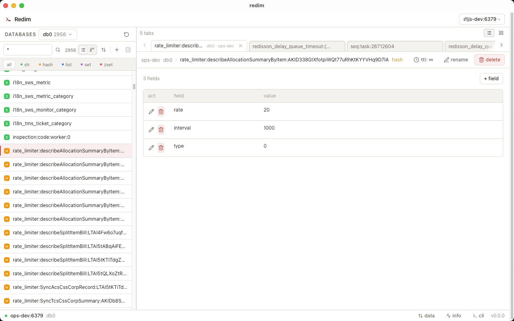

<div align="center">

# Redim

一款基于 Tauri 构建的现代化跨平台 Redis 桌面客户端。


 


**[English](./README.md)** | 中文




</div>

## 功能特性

- **连接管理** - 保存、测试和切换多个 Redis 连接
- **树形视图** - 按前缀分组浏览 Key，支持展开/折叠
- **数据操作** - 完整支持 String、Hash、List、Set、ZSet 的增删改查
- **模糊搜索** - 使用模式匹配搜索 Key（如 `user:*`）
- **CLI 终端** - 执行 Redis 命令，支持自动补全
- **监控面板** - 实时查看服务器状态、内存使用、ops/sec
- **导入/导出** - 以 JSON/CSV 格式备份和恢复数据
- **简约界面** - 干净的界面，支持浅色主题

## 安装

### 下载

从 [Releases](https://github.com/mintya/redim/releases) 下载最新版本：

| 平台 | 安装包 |
|------|--------|
| Windows | `.msi` |
| macOS | `.dmg` |
| Linux | `.AppImage` / `.deb` |

### 从源码构建

```bash
git clone https://github.com/mintya/redim.git
cd redim
yarn install
yarn tauri dev      # 开发模式
yarn tauri build    # 生产构建
```

## 快捷键

| 快捷键 | 功能 |
|--------|------|
| `⌘K` / `Ctrl+K` | 打开 CLI 终端 |
| `⌘M` / `Ctrl+M` | 打开监控面板 |

## 技术栈

- [Tauri](https://tauri.app/) - 桌面应用框架
- [Svelte 5](https://svelte.dev/) - 前端框架
- [Tailwind CSS](https://tailwindcss.com/) - 实用优先的 CSS
- [Redis](https://redis.io/) - 内存数据库

## 项目结构

```
src/
├── lib/
│   ├── components/     # UI 组件
│   ├── stores/         # 状态管理
│   ├── types/          # TypeScript 类型
│   └── utils/          # 工具函数
└── routes/             # 页面

src-tauri/
├── src/
│   ├── lib.rs          # Tauri 命令
│   ├── models.rs       # 数据模型
│   └── redis_manager.rs
└── icons/              # 应用图标
```

## 参与贡献

1. Fork 本项目
2. 创建功能分支 (`git checkout -b feature/xxx`)
3. 提交更改 (`git commit -m 'Add xxx'`)
4. 推送到分支 (`git push origin feature/xxx`)
5. 创建 Pull Request

## 开源协议

MIT License
